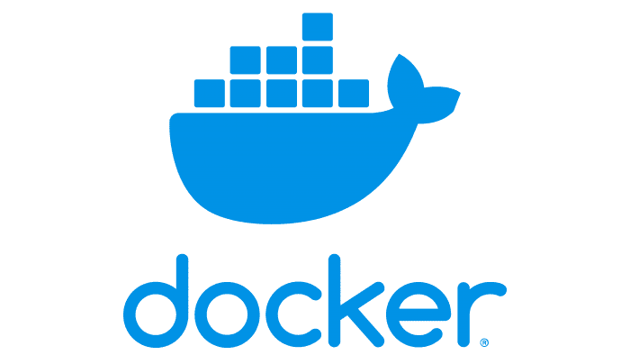
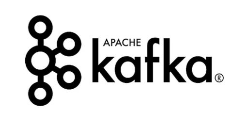
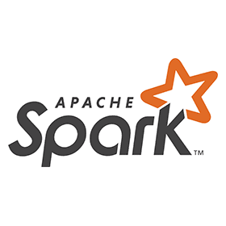
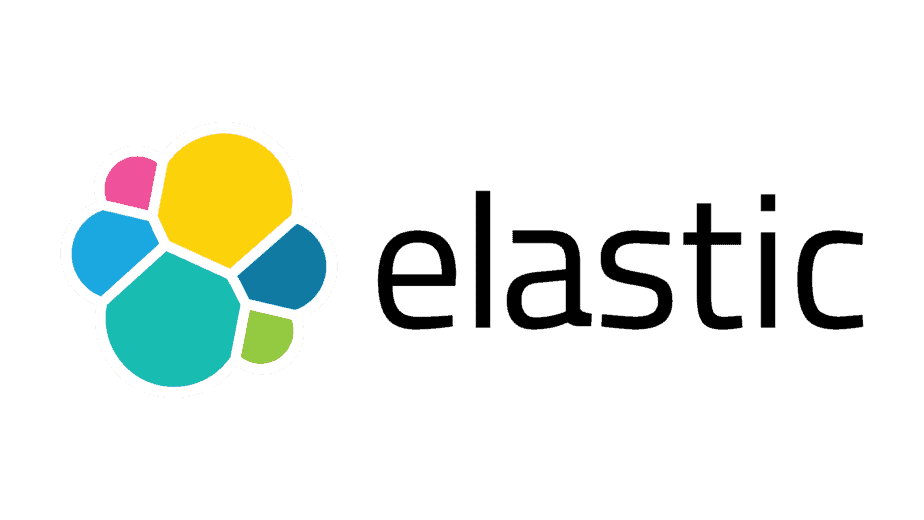
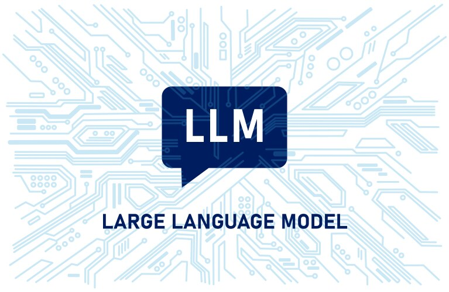

# Indeed scraping for chatbot interaction

This repo contain the project code for the course "Technologies for Big Data Management" held by professor Massimo Callisto at the university of Camerino. 

### Table of Contents:
1. [Introduction](#introduction)
1. [Technologies](#technologies)
    1. [Docker](#docker)
    1. [Kafka](#kafka)
    1. [Apache Spark](#spark)
    1. [ChromaDB](#chromadb)
    1. [Elastic and Kibana](#elastic)
    1. [LLMs](#llm)
1. [Prerequisites](#prerequisites)
1. [Installation & Configuration](#installation-and-configuration)  
1. [Usage](#usage)  
    1. [IoT Simulator](#iot-simulator-1)
    1. [MQTT Dumper](#mqtt-dumper-1)
    1. [Kafka Stream](#kafkastream-2)
    1. [Presto](#presto-1)
    1. [Jupyter Connection](#jupyter-1)
1. [Results](#results)  
    1. [Line Chart](#linechart-1)
    1. [Bar Chart](#barchart-1)
    1. [Pie Chart](#piechart-1)
1. [License](#license)
1. [Contact Information](#contact-information) 

## Introduction
The scope of this project is to dynamically scrape reviews from Indeed in order to embed them in the context of a chatbot. This chatbot will then communicate with the user and it will be able to answer questions about said company. For example, a user might be interested in the salary level of a certain company but maybe doesn't want to read thousands of reviews to find that out. This project aims to find a solution just to that.
The application scrapes data from the web, then embeds it into a vector database in order for them to be used later when the user asks a question.

## Technologies

### [Docker](#docker)

  

Docker is a platform designed to help developers build, package, and deploy applications in containers. Containers allow applications to be portable and consistent across different environments by encapsulating them with all their dependencies. Docker containers provide lightweight virtualization, improving development workflows and infrastructure consistency. It simplifies the setup and scaling of environments, especially in CI/CD pipelines and microservices architectures. Docker is widely used to manage the lifecycle of applications and improve deployment efficiency.

### [Apache Kafka](#kafka)

  

Apache Kafka is a publish-subscribe messaging solution designed for real-time data streaming and distributed pipelines. It excels at high-performance data integration, streaming analytics, and data feed replaying. Kafka servers store data streams as records within a cluster, ensuring durability and scalability. Kafka’s Streams API allows developers to process, filter, and aggregate real-time data streams to build sophisticated streaming applications. Its versatility has made it essential for building real-time applications in various industries.

### [Apache Spark](#spark)

  

Apache Spark is a powerful distributed processing engine that handles large-scale data processing across clusters in real-time and batch modes. With its in-memory computing capabilities, Spark delivers high-speed processing of big data. It integrates well with various data storage solutions such as HDFS, Cassandra, and S3, and provides APIs for different programming languages, including Python, Java, and Scala. Apache Spark’s structured streaming and machine learning libraries make it a popular choice for processing big data in real time and advanced analytics.

### [ChromaDB](#chromadb)

  

ChromaDB is a vector database designed to handle high-dimensional data such as embeddings used in AI applications. It supports operations such as searching, clustering, and organizing vectorized data efficiently. As machine learning models and LLMs often produce large volumes of embedded data, ChromaDB provides a scalable solution to store and query this data in real-time. Its efficient handling of embeddings makes it a core component of many AI-based workflows.

### [Elastic and Kibana](#elastic)

  

Elastic (Elasticsearch) is a distributed, RESTful search engine designed for large volumes of data, such as logs or metrics. It is commonly used for full-text search, analytics, and monitoring. Elasticsearch is part of the Elastic Stack, which includes Kibana for visualizing search results and managing queries. Together, Elastic and Kibana provide a comprehensive solution for real-time search and analytics across datasets, making them popular in log analysis, infrastructure monitoring, and business analytics use cases.

### [LLMs](#llm)

  

Large Language Models (LLMs) are AI models designed to understand and generate human language. With advancements in deep learning and transformer architectures, LLMs such as GPT-3, BERT, and others have demonstrated impressive capabilities in tasks like text generation, summarization, translation, and more. LLMs are integral to many NLP applications, helping businesses automate processes, build chatbots, enhance search engines, and create personalized user experiences through natural language understanding.

## Prerequisites(#prerequisites)
The prerequisites are:
- Python 3.12.4
- Docker and docker-compose
- Git (to clone this repo)
- JDK 17 (to start the spark application)

To download Python 3.12.4 you can follow the guide in the [python 3.12.4 installation page](https://www.python.org/downloads/release/python-3124/) and choose the correct version according to your system.

To download Docker you can follow the guide in the [docker installation page](https://www.docker.com/products/docker-desktop/) and choose the correct version according to your system.

To download Git you can follow the guide in the [git installation page](https://git-scm.com/downloads) and choose the correct version according to your system.

To download and install the JDK 17 you can follow the guide in the [JDK 17 installation page](https://docs.oracle.com/en/java/javase/17/install/overview-jdk-installation.html) and choose the correct version according to your system.
