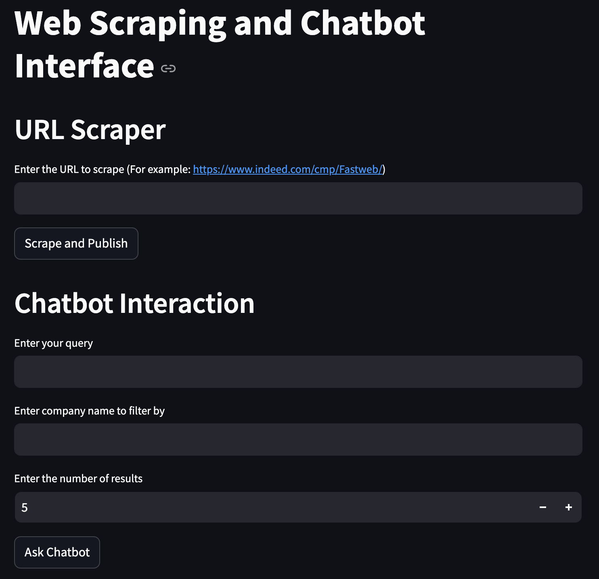
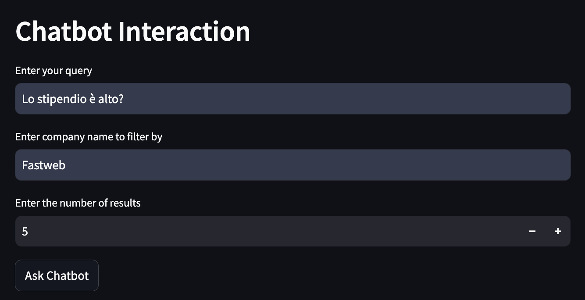
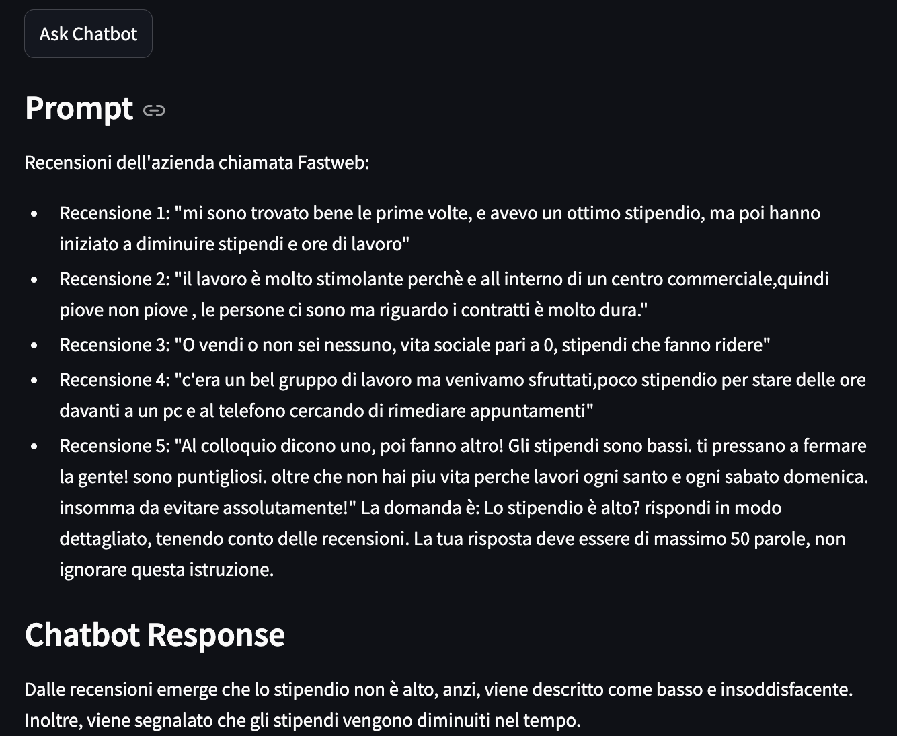
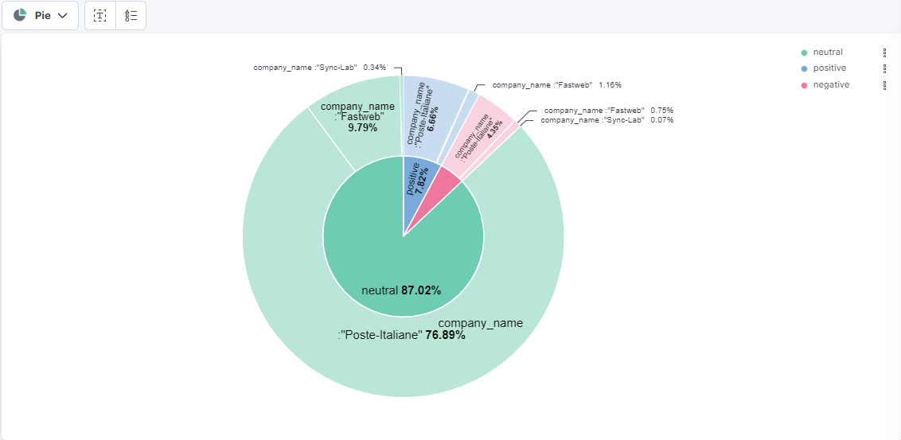
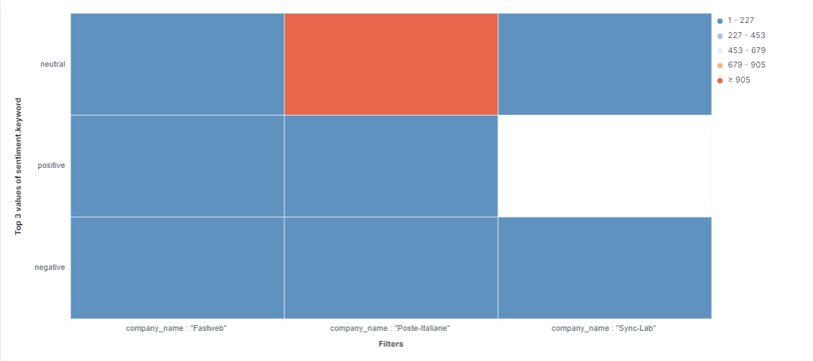

# Indeed scraping for chatbot interaction

This repo contain the project code for the course "Technologies for Big Data Management" held by professor Massimo Callisto at the university of Camerino. 

### Table of Contents:
1. [Introduction](#introduction)
1. [Technologies](#technologies)
    1. [Docker](#docker)
    1. [Apache Kafka](#kafka)
    1. [Apache Spark](#spark)
    1. [ChromaDB](#chromadb)
    1. [Elastic and Kibana](#elastic)
    1. [LLMs](#llm)
1. [Prerequisites](#prerequisites)
1. [Installation & Configuration](#installation-and-configuration)  
1. [Usage](#usage)  
1. [Results](#results)
    1. [Chatbot Response](#chatbotResponse)
    1. [Sentiment Analysis](#sentiment)
    1. [Word Cloud](#wordCloud)
1. [License](#license)
1. [Contact Information](#contact-information) 

## [Introduction](#introduction)
The scope of this project is to dynamically scrape reviews from Indeed in order to embed them in the context of a chatbot. This chatbot will then communicate with the user and it will be able to answer questions about said company. For example, a user might be interested in the salary level of a certain company but maybe doesn't want to read thousands of reviews to find that out. This project aims to find a solution just to that.
The application scrapes data from the web, then embeds it into a vector database in order for them to be used later when the user asks a question.

## [Technologies](#technologies)

### [Docker](#docker)
<p align="center">
  
</p>

Docker is a platform designed to help developers build, package, and deploy applications in containers. Containers allow applications to be portable and consistent across different environments by encapsulating them with all their dependencies. Docker containers provide lightweight virtualization, improving development workflows and infrastructure consistency. It simplifies the setup and scaling of environments, especially in CI/CD pipelines and microservices architectures. Docker is widely used to manage the lifecycle of applications and improve deployment efficiency.

### [Apache Kafka](#kafka)
<p align="center">
  
</p>

Apache Kafka is a publish-subscribe messaging solution designed for real-time data streaming and distributed pipelines. It excels at high-performance data integration, streaming analytics, and data feed replaying. Kafka servers store data streams as records within a cluster, ensuring durability and scalability. Kafka’s Streams API allows developers to process, filter, and aggregate real-time data streams to build sophisticated streaming applications. Its versatility has made it essential for building real-time applications in various industries.

### [Apache Spark](#spark)
<p align="center">
  
</p>

Apache Spark is a powerful distributed processing engine that handles large-scale data processing across clusters in real-time and batch modes. With its in-memory computing capabilities, Spark delivers high-speed processing of big data. It integrates well with various data storage solutions such as HDFS, Cassandra, and S3, and provides APIs for different programming languages, including Python, Java, and Scala. Apache Spark’s structured streaming and machine learning libraries make it a popular choice for processing big data in real time and advanced analytics.

### [ChromaDB](#chromadb)
<p align="center">
  
</p>

ChromaDB is a vector database designed to handle high-dimensional data such as embeddings used in AI applications. It supports operations such as searching, clustering, and organizing vectorized data efficiently. As machine learning models and LLMs often produce large volumes of embedded data, ChromaDB provides a scalable solution to store and query this data in real-time. Its efficient handling of embeddings makes it a core component of many AI-based workflows.

### [Elastic and Kibana](#elastic)
<p align="center">
  
</p>

Elastic (Elasticsearch) is a distributed, RESTful search engine designed for large volumes of data, such as logs or metrics. It is commonly used for full-text search, analytics, and monitoring. Elasticsearch is part of the Elastic Stack, which includes Kibana for visualizing search results and managing queries. Together, Elastic and Kibana provide a comprehensive solution for real-time search and analytics across datasets, making them popular in log analysis, infrastructure monitoring, and business analytics use cases.

### [LLMs](#llm)
<p align="center">
  
</p>

Large Language Models (LLMs) are AI models designed to understand and generate human language. With advancements in deep learning and transformer architectures, LLMs such as GPT-3, BERT, and others have demonstrated impressive capabilities in tasks like text generation, summarization, translation, and more. LLMs are integral to many NLP applications, helping businesses automate processes, build chatbots, enhance search engines, and create personalized user experiences through natural language understanding.

## [Prerequisites](#prerequisites)
The prerequisites are:
- Python 3.12.4
- Docker and docker-compose
- Git (to clone this repo)
- JDK 17 (to start the spark application)

To download Python 3.12.4 you can follow the guide in the [python 3.12.4 installation page](https://www.python.org/downloads/release/python-3124/) and choose the correct version according to your system.

To download Docker you can follow the guide in the [docker installation page](https://www.docker.com/products/docker-desktop/) and choose the correct version according to your system.

To download Git you can follow the guide in the [git installation page](https://git-scm.com/downloads) and choose the correct version according to your system.

To download and install the JDK 17 you can follow the guide in the [JDK 17 installation page](https://docs.oracle.com/en/java/javase/17/install/overview-jdk-installation.html) and choose the correct version according to your system.

## [Installation & Configuration](#installation-and-configuration)
Once the prerequisites are correctly installed, we can go on to setup the environments in order to run the project.

First thing first, we need to install the python dependecies. We suggest to use a virtual environment like pipenv. To install the dependencies you have to run the command
```bash
pipenv install -r requirements.txt
```
this allows you to install all of the Python 3.12.4's dependencies with a single command.

Once the python requirements are installed, you can create the docker container. First, position yourself in the root directory of the project. Then, run the command 
```bash
docker-compose up -d
```
This will create and build the pre-defined virtual environment. This environment will handle every service by itself, without needing the user to manually setup anything. Everything is already handled and pre-defined inside the Dockerfile, docker-compose.yaml, .env file and chroma_configs/ directory.

## [Usage](#usage)
To use the program, first move into the virtual environment shell
```bash
pipenv shell
```
This will open the virtual environment so that we can use all of the dependencies that we've previously installed.

Then we need to move inside the 'src/' folder and set the PYTHONPATH
```bash
cd src/
export PYTHONPATH=$(pwd) 
```
**IMPORTANT**: those first two steps must be repeated every time you open a new terminal.

Before taking a look at the scraper, we first need to start the two consumers. To do this, we must open two different terminals in order to be able to interact with them. In the first terminal, run the commands 
```bash
chmod +x codeKafka/submit.sh
bash codeKafka/submit.sh
```
while in the second terminal, run the command
```bash
python codeKafka/consumer_elastic.py
```
In the **first terminal** we will start the consumer that writes the data on the vector database, while in the **second terminal** we will interact with the one that writes on the ElasitSearch indexes.

To start the scraper and the chatbot app, we need to start the streamlit webapp **on yet another terminal** by using the command
```bash
streamlit run app.py
```
By going on the [streamlit main page](http://localhost:8501), the app will present itself like this
<p align="left">
  
</p>
In the first section you can enter a link to scrape, like the one given by example. While scraping, the entire webapp will be blocked and cannot be used until the application has completed the process. In the second one, we can ask the chatbot a question. We can do this even without scraping any sites if the information is already present inside the vector database. To correctly use the chatbot, we have to keep in mind two things:

1. The name of the company must match the one present in the Indeed link. For example, if we want to scrape Poste Italiane and the company name in the link is "Poste-Italiane" we must put that inside of the field;
2. The number of results should be chosen carefully. More results do not automatically mean a better chatbot response. For example, if a company has 20 reviews and we choose 10 results for the query we will probably get reviews that have nothing in common with the question we've asked. This happens because the sample of reviews isn't big enough. On the other hand, if a company has thousands of review putting a number that is too low could exclude some important context from the question. Also keep in mind that chatbots do not perform well with prompts that are too complex and lengthy.

The following is an example of how to use the chatbot:
<p align="left">
  
</p>

Finally, the user can access the indexes with Elastic and Kibana and create dashboard to analyze the data by accessing the [kibana main page](http://localhost:5601). 

## [Results](#results)
### [Chatbot Response](#chatbotResponse)
The following is a response example from the chatbot, based on the prompt described above
<p align="center">
  
</p>
As we can see, we are able to visualize both the prompt and the answer.

### [Sentiment Analysis](#sentiment)
We've constructed two dashboards in Kibana, the first one represents the sentiment analysis. This was computed using the python package **text_blob**. The first kind of plot is a pie chart containing the percentages of the sentiment like the following:
<p align="center">
  
</p>
The second plot is an heatmap that describes the polarities of the companies
<p align="center">
  
</p>

### [Word Cloud](#wordCloud)
We also defined a word cloud so that we are able to see the most used words in the reviews and gain usefule insights. The following is an example for Fastweb:
<p align="center">
  
</p>

## License

Indeed scraping for chatbot interaction is available under the MIT [license](https://github.com/Meguazy/Review-scraper-chatbot-embedding/blob/main/LICENSE)

## Contact Information

| Contact | Mail |
| --- | --- |
| Francesco Finucci | francesco.finucci@studenti.unicam.it |
| Andrea Palmieri   | andrea03.palmieri@studenti.unicam.it |
